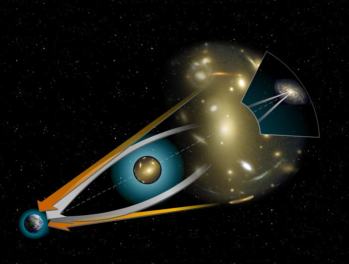

# Chapter 1
## Foundations of Physics

## Goals

- Understand key terms used in science and physics
- Understand the scientific method
- Know how science can go wrong (vs. scientific ideal)
- Be able to identify why a hypothesis or theory is unusable

## **1A** Why Study Physics

>"... have dominion over the fish of the sea, and over the fowl of the air, and over every living thing that moveth upon the earth." _Genesis 1:28_

## **1B** What is Physics?

## Science

> Science is a systematic enterprise that builds and organizes knowledge in the form of testable explanations and predictions about the universe.

from Latin scientia, meaning "knowledge" <!-- .element: class="fragment"-->

Francis Bacon

Rene Descartes (Latinized: Renatus Cartesius)

## Hypothesis
a proposed _testable_ explanation for a phenomenon

## Theory

> A rigorously developed framework that explains and predicts _why_ many phenomena take place

## Law

> A descriptive account of _how_ nature will behave under certain conditions

## Empirical Science

> Science based _observation_ or _experimentation_

## Model

> A usable simplified reflection of reality

## Paradigm

> A widely accepted thought pattern with which we try to fit new ideas

### _The Structure of Scientific Revolutions_
Thomas Kuhn

> "Successive transition from one paradigm to another via revolution is the usual developmental pattern of mature science."

## Classical Physics

## Modern Physics

## **1C** How do good Physicists Work?

### A good (workable) hypothesis
- Reasonable <!-- .element: class="fragment"-->
- Testable <!-- .element: class="fragment"-->
- Should not contradict established principles <!-- .element: class="fragment"-->
- Explain current observations and predict new ones <!-- .element: class="fragment"-->
- Simple as possible <!-- .element: class="fragment"-->

