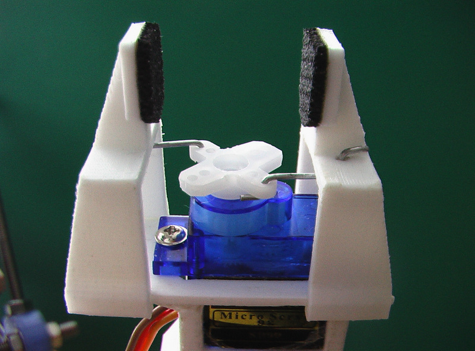

# Chapter 1
## Foundations of Physics

##Goals

- 

## **1A** Why Study Physics

>"... have dominion over the fish of the sea, and over the fowl of the air, and over every living thing that moveth upon the earth." _Genesis 1:28_

## **1B** What is Physics?

## Science

## Hypothesis

## Theory

## Law

## Empirical Science

## Model

## Paradigm

### _The Structure of Scientific Revolutions_
Thomas Kuhn

## Classical Physics

## Modern Physics

## **1C** How do good Physicists Work?

### A good (workable) hypothesis
- Reasonable <!-- .element: class="fragment"-->
- Testable <!-- .element: class="fragment"-->
- Should not ~~contradict~~ established principles <!-- .element: class="fragment"-->
- Explain current observations and predict new ones <!-- .element: class="fragment"-->
- Simple as posible <!-- .element: class="fragment"-->

<!-- .slide: data-background="#ff0000" -->
#Another Page

###What??
- [x] Do something
- [ ] Something else

What else

##Things

- item
- item
- item

Things

Note: 
This is a note
THis is more
$$x_f=x_i+v_it+\frac{1}{2}at^2$$

x   |   y | t
--- | --- | ---
1.3 | 1.500000 | 4.6
1.5333 | 1.6 | 4.9
1.7 | 1.7 | 4.12234234

This is it

- Testing <!-- .element: class="fragment"-->
- Testing 13 <!-- .element: class="fragment"-->
- Another <!-- .element: class="fragment"-->
- Stuff and more stuff <!-- .element: class="fragment"-->

 <!-- .element: class="stretch"-->

$$x_f=x_i+v_it+\frac{1}{2}at^2$$

#The End