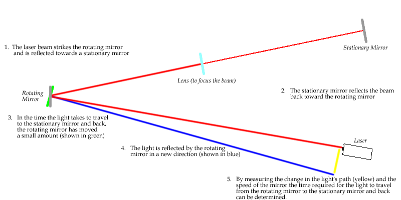

<section>

#Chapter 1#

##This is cool##
</section>
<section>

Things to know
-----------
- Math {: .test}
- Logic
- New Stuff
- Old Stuff
</section>
<section>
You can find more [here](http://google.com).

</section>
<section>

</section>
<section>

 {: .print}

#The experiment

</section>
<section>

##Some stuff

1. things
2. more things \(x^2\)
3. other stuff

</section>
<section>
<section>

#Top
$$x_f=x_i+v_it+\frac{1}{2}at^2$$

</section>
<section>

#middle

</section>
<section>

#Bottom

</section>
</section>
<section>

$$k_{n+1} = n^2 + k_n^2 - k_{n-1}$$

$$\frac{n!}{k!(n-k)!} = \binom{n}{k}$$

</section>
<section>
#does this work
Maybe?

This is a $$k_{n+1} = n^2 + k_n^2 - k_{n-1}$$ thing.

</section>
<section>

$$
\begin{aligned}
\nabla \times \vec{\mathbf{B}} -\, \frac1c\, \frac{\partial\vec{\mathbf{E}}}{\partial t} & = \frac{4\pi}{c}\vec{\mathbf{j}} \\   \nabla \cdot \vec{\mathbf{E}} & = 4 \pi \rho \\
\nabla \times \vec{\mathbf{E}}\, +\, \frac1c\, \frac{\partial\vec{\mathbf{B}}}{\partial t} & = \vec{\mathbf{0}} \\
\nabla \cdot \vec{\mathbf{B}} & = 0 \end{aligned}
$$

</section>
<section>

$$ {: #big }
\begin{aligned}
f & = m a \\
a & = \frac{f}{m} \\
& = \frac{12.7N}{3.5\times10^5kg} = 3.6\times10^{-5} m/s^2 \end{aligned}
$$

</section>
