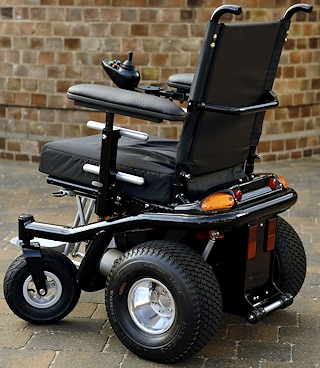
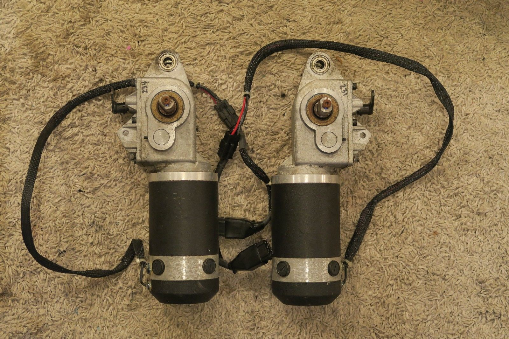
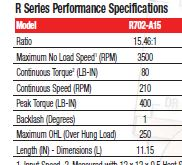
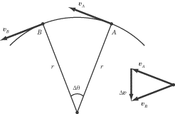

# Chapter 7
## Circular Motion

## Goals

- Know units used in circular motion
- Be able to calculate angular velocity and acceleration for uniform circular motion
- Be able to calculate centripetal force
- Use the universal law of gravity

### Home work
pg 145 #4, 6

## **7A** Circular Motion

### Position In Circular motion

* Position is measured as a vector, $\mathbf{r}$
* Rotation is measured as an angle, $\theta$ , in radians
* Distance from centre is ,$ \mathit{r}$ , in meters

Ex: If David swung his sling 4 and a half times before releasing the stone in the direction of the giant, what was the total rotational displacement of the sling?

## Angular Velocity

$$ \omega = \frac{\Delta \theta }{\Delta t} $$

Ex: If it takes 0.85s for the wheel of a robot to complete one rotataton, what is the angular velocity of the wheel?

Ex: The output shaft on a power chair drive gearmotor rotates at 210RPM. What is the angular valocity in IS units?

### Angular to Linear Velocity 

Ex: What is the maximum speed of the power chair if it has 15 inch (0.381m) tires?

## Angular Acceleration

$$ \alpha  = \frac{\Delta \omega }{\Delta t} $$

Term: **Uniform Circular Motion**

$$ \alpha = 0 $$

## Equations of Circular Motion

## Centripetal Acceleration

$$ \bar{a} = \frac{v\_{t}^{2}}{r} $$

$$ \mathbf{a}\_{c} = -\mathbf{r}\omega^{2} $$

## **7B** Dynamics of Circular Motion

## Centripetal Force

$$ F_c = \frac{mv_{t}^{2}}{r} $$

### Torque

$$ \tau = rF  $$

If F is not pulling at a right angle:

$$ \tau = rF sin\theta  $$

