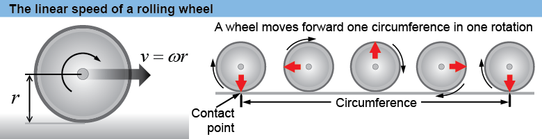
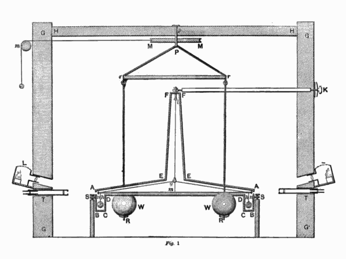

# Chapter 7
## Circular Motion

## Goals

- Know units used in circular motion
- Be able to calculate angular velocity and acceleration for uniform circular motion
- Be able to calculate centripetal force
- Use the universal law of gravity

### Home work
Terms: Angular Velocity, Tangential Velocity,  Angular Acceleration, Centripetal Acceleration, Centripetal Force, Uniform Circular Motion
pg 145 #4, 6
pg 150 #5
pg 161 #46

## **7A** Circular Motion

### Position In Circular motion

* Position is measured as a vector, $\mathbf{r}$
* Rotation is measured as an angle, $\theta$ , in radians
* Distance from centre is ,$ \mathit{r}$ , in meters

Ex: If David swung his sling 4 and a half times before releasing the stone in the direction of the giant, what was the total rotational displacement of the sling?

## Angular Velocity

$$ \omega = \frac{\Delta \theta }{\Delta t} $$

Ex: If it takes 0.85s for the wheel of a robot to complete one rotataton, what is the angular velocity of the wheel?

Ex: What is the angular velocity of the earth?

Ex: The output shaft on a power chair drive gear motor rotates at 210RPM. What is the angular velocity in SI units?

### Angular to Linear Velocity 

Ex: What is the maximum speed of the power chair if it has 15 inch (0.381m) tires?

Ex: What is the velocity of a person standing on the surface of earth?

## Angular Acceleration

$$ \alpha  = \frac{\Delta \omega }{\Delta t} $$

Term: **Uniform Circular Motion**

$$ \alpha = 0 $$

## Equations of Circular Motion

 
## Centripetal Acceleration

<!-- .slide: data-background="#ffffff" -->

$$ \bar{a} = \frac{v\_{t}^{2}}{r} $$

$$ \mathbf{a}\_{c} = -\mathbf{r}\omega^{2} $$

## **7B** Dynamics of Circular Motion

## Centripetal Force

$$ F\_c = \frac{mv\_{t}^{2}}{r} $$

### Torque

$$ \tau = rF  $$

If F is not pulling at a right angle:

$$ \tau = rF sin\theta  $$

If the above wheelchair motors have a max Torque of 45 Nm, what is the forward force on the chair?

## **7C** Universal Gravitation

$$ F\_g = G\frac{m\_1 m\_2}{r^2} $$

$$ G = 6.674 \times 10^{-11} N\cdot m^2/kg^2 %%

Ex: How fast will an 1.5 kg object fall on earth?

Ex: What is the mass of earth?