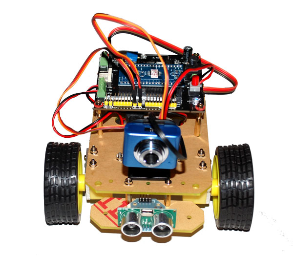

<section>

#Introduction to Robotics#

##Charles Meyer##
</section>
<section>

#Why Robots?#

</section>
<section>

##Robotics Challenge#

* Navigate to light emitting beacon
* Avoid or traverse various obstacles
* Team that completes each course in the least time wins

</section>
<section>

##Requirements#

* Fully autonomous robot
* Max height 15cm
* Less than 0.5 Kg
* Safe

</section>
<section>

#Stewardship

* Facilities
* Tools
* Reusable components
* Consumable Supplies

</section>
<section>

#Safety

</section>
<section>

#Components

</section>
<section>

##Continuous Rotation Servo

</section>
<section>

##Arduino Microcontroller

</section>
<section>

##Solderless Breadboard

</section>
<section>

##Batteries

</section>
<section>

##Photo-resistors

</section>
<section>

##Micro switches

</section>
<section>

#Design considerations

</section>
<section>

##Weight

</section>
<section>

##Size

</section>
<section>

##Stability

</section>
<section>

##Climbing Ability

</section>
<section>

##Speed

</section>
<section>

##Looks 

</section>
<section>

#Robot Examples

</section>
<section>

</section>
<section>

</section>
<section>

</section>
<section>

</section>
<section>

</section>
<section>

</section>
<section>

</section>
<section>

</section>
<section>

</section>
<section>

</section>
<section>

</section>
<section>

</section>
<section>

</section>
<section>

</section>
<section>

</section>
<section>

</section>
<section>

</section>
<section>

</section>
<section>

</section>
<section>

</section>
<section>

</section>
<section>

</section>
<section>

</section>
<section>

</section>
<section>

</section>
<section>

</section>
<section>

</section>
<section>

</section>
<section>

</section>
<section>

</section>
<section>

</section>
<section>

</section>
<section>

</section>
<section>

</section>
<section>

</section>
<section>

</section>
<section>

</section>
<section>

</section>